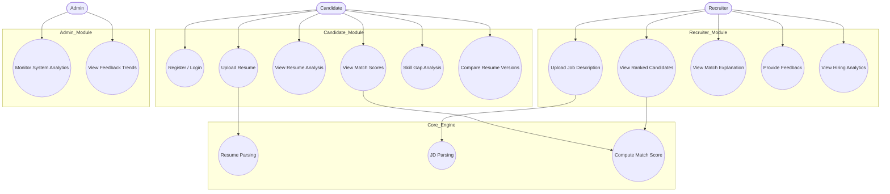

# Use Case Diagram – HireLens AI

---

## Planned Enhancements

> The following use cases and features were intentionally excluded from the current implementable scope and are planned for future iterations:

1. **Python AI Microservice** — NLP-based text processing, named entity recognition for skill extraction, embedding vector generation using sentence transformers
2. **Embedding-Based Matching (EmbeddingStrategy)** — Semantic similarity scoring using cosine distance on embedding vectors instead of keyword overlap
3. **MongoDB Atlas Vector Search** — Vector storage and retrieval for resume and JD embeddings
4. **Adaptive Scoring Engine** — Dynamically adjusts scoring weights (skill, experience, project, domain) based on historical recruiter feedback using an Observer pattern
5. **Learning Roadmap Generator** — Generates a prioritized, timeline-based upskilling roadmap with resource suggestions based on identified skill gaps
6. **MODEL_VERSION & MODEL_PERFORMANCE tracking** — Database layer for versioning scoring models and storing precision/recall/accuracy metrics over time
7. **Bias Detection & Fairness Monitoring** — Admin-level monitoring for demographic or skill-group bias in candidate rankings
8. **Multi-Model Ensemble Scoring** — Combining outputs from multiple scoring strategies for more robust match accuracy
9. **AI-Powered Interview Question Generator** — Auto-generates role-specific interview questions based on JD and candidate skill gaps
